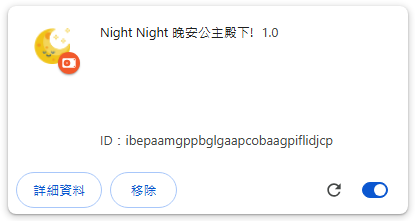
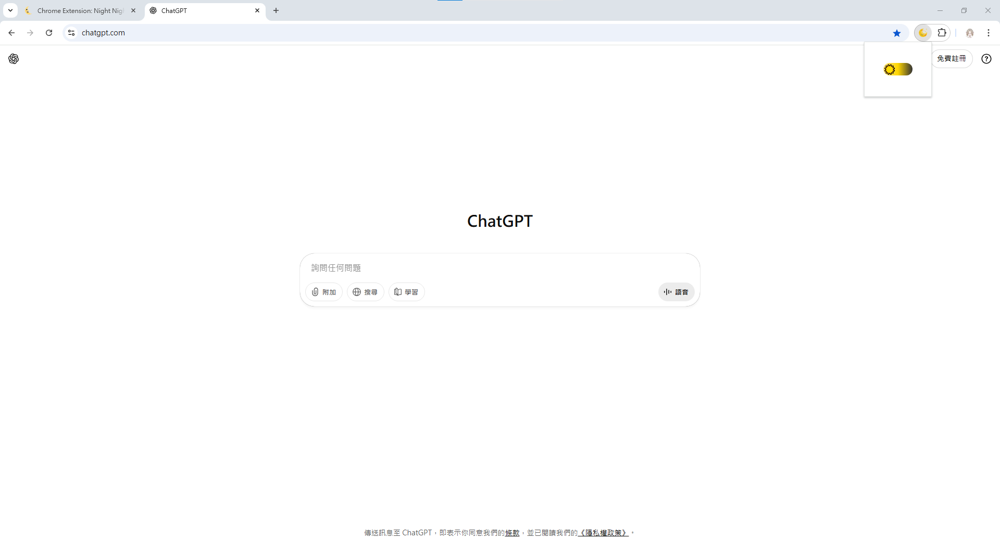
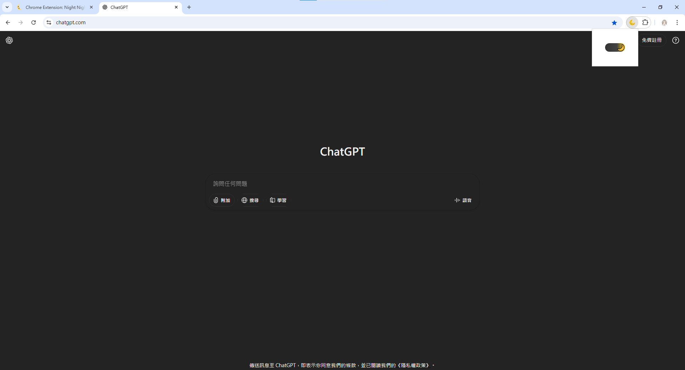

#  Night Night 晚安公主殿下!

這是一款黑夜模式切換的 Chrome 擴充功能，一鍵切換任意網頁的黑夜/白天的背景主題，
並以極簡的日象月象切換滑軌開關方式呈現。提醒公主殿下用黑夜模式保護眼睛

## 特色
- 一鍵切換暗黑/亮色模式，支援大多數網站
- 極簡滑軌開關 UI，動畫流暢，icon 動態切換
- 僅允許在 http/https/file 網頁切換，安全不報錯

## 安裝與使用

### ⭐ 安裝依賴
```sh
npm install
```

### ⭐ 開發模式啟動
```sh
npm run dev
```

### ⭐ 打包專案
```sh
npm run build
```

### ⭐ 載入 Chrome 擴充功能
打開 Chrome → 更多工具 → 擴充功能 → 開啟「開發人員模式」 → 點擊「載入未封裝項目」 → 指定 public/（或 build 後的 dist/）

### ⭐ 使用插件
安裝後，點擊工具列的像是下方的 Night Night 圖示，即可切換夜間模式。

## 畫面截圖

- 載入檔案後會在所有擴充功能下方看到該圖示



  <br>
  
- 點擊插件後出現開關預設：🌞日間模式
  


  <br>

- 點擊開關會切換到：🌜黑夜模式
  


## 專案結構說明

```
📁 FCU_Web_Sem2_Final_ChromeExtension_NightNight/
│
├── index.html                 // 專案入口 HTML，開發與測試時的主頁面
├── jsconfig.json              // JavaScript 專案配置，提供 IDE 提示與路徑別名設定
├── package.json               // 管理專案依賴套件與 npm 腳本
├── README.md                  // 專案說明文件（使用方式、安裝流程、功能簡介）
├── vite.config.js             // Vite 打包與開發伺服器的設定檔
│
├── 📁 public/                 // 靜態資源與 Chrome 擴充功能必須檔案
│   ├── content-script.js      // 注入至網頁中執行的腳本，負責夜間模式切換。
│   ├── favicon.ico            // 預設網站小圖示
│   ├── icon16.png             // 擴充功能圖示（16x16，工具列使用）
│   ├── icon32.png             // 擴充功能圖示（32x32，設定頁或彈窗）
│   ├── icon64.png             // 擴充功能圖示（64x64，較高解析度場合）
│   ├── icon128.png            // 擴充功能圖示（128x128，Chrome Web Store）
│   └── manifest.json          // Chrome 擴充功能描述檔，定義權限、腳本、圖示等
│
└── 📁 src/                   // 前端原始碼（Vue 專案）
├── main.js                   // Vue 入口檔案，初始化並掛載 App.vue
├── App.vue                   // Vue 主組件，整體應用的根元件，負責頁面結構與路由。
│
├── 📁 assets/                // 靜態資源（圖片、樣式）
│   ├── base.css              // 基礎樣式
│   ├── main.css              // 全域樣式
│   └── logo.svg              // 預設 Vue Logo
│
└── 📁 components/            // Vue 元件
```

## 主要檔案註解

### manifest.json
- `name`：擴充功能名稱
- `version`：版本號
- `action.default_popup`：popup 頁面
- `permissions`/`host_permissions`：腳本注入權限
- `icons`：自訂 icon

### content-script.js
- 注入網頁時，插入/移除全局暗黑 CSS，並用 MutationObserver 保證 SPA 也能正確切換

### App.vue
- 只顯示一個滑軌開關，icon 會根據狀態顯示太陽或月亮
- 只允許在 http/https/file 頁面注入腳本，chrome:// 等頁面會彈出提示
- CSS 控制滑軌、icon 動畫、顏色與位置，確保只有一個 icon 會顯示且滑動流暢

## 常見問題

- **Q: 為什麼在 chrome:// 頁面無法切換？**
  A: Chrome 安全限制，無法在這類頁面注入腳本，會彈出提示。
- **Q: 如何更換 icon？**
  A: 將 16/32/48/64/128px PNG 放到 public 資料夾，並在 manifest.json 設定對應路徑。
